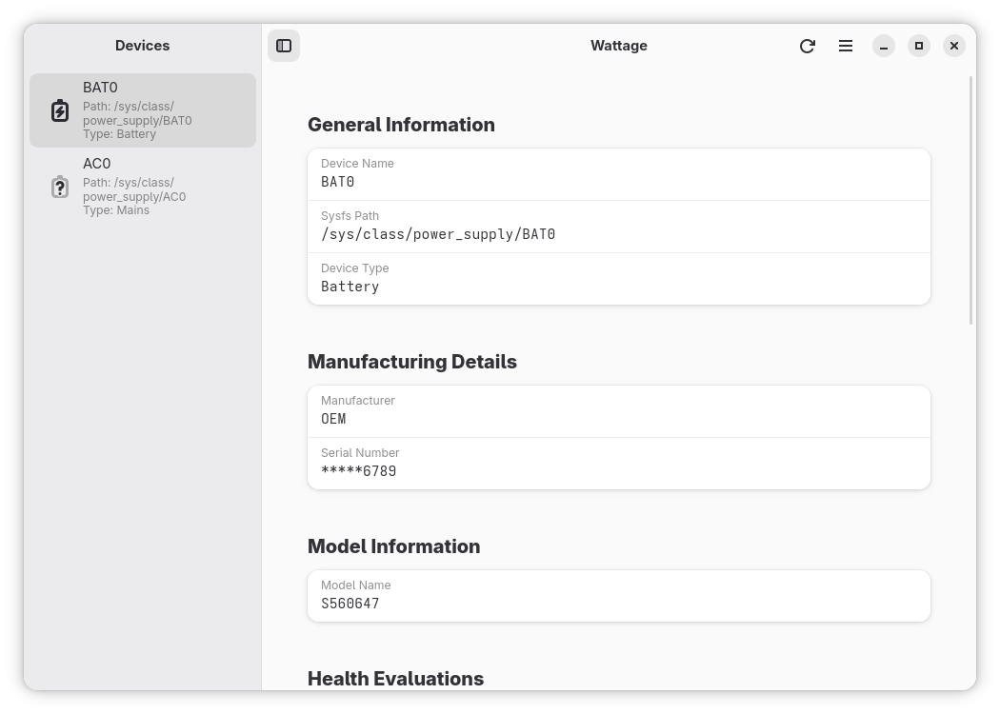
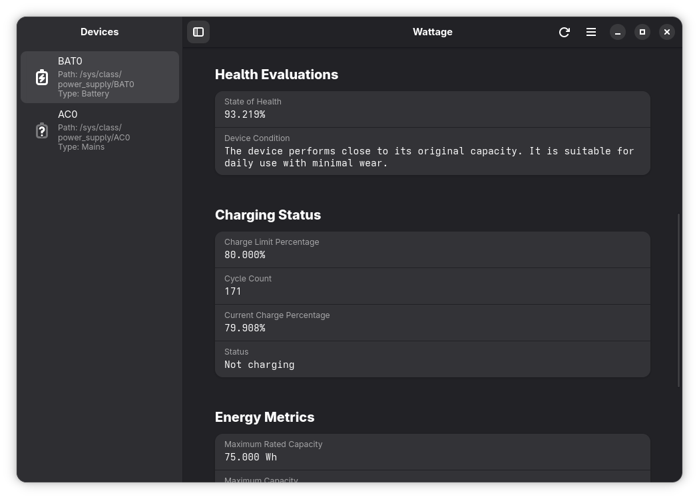

 

# Ampere

Ampere is a Linux application designed for monitoring the health and status of your power devices. It displays quick data regarding battery capacity, energy metrics, and device information through a clean, modern GTK 4 + libadwaita interface.

## Features

- Monitor a variety of statistics regarding your battery.
- View battery health, voltage data, model information, manufacturing details, and device status.
- Support for multiple batteries or power sources.
- Interface built with GTK 4 and libadwaita.
- Written in Vala, which is fast since it compiles to C.
- Designed for Linux systems with UPower or sysfs battery information.

## Installation

Coming soon!

### Requirements

- Linux system with battery or power device support.
- And more ... (coming soon!)

## Contributing

Contributions are welcome! To get started:

1. Fork the repository.
2. Create a feature branch (`git checkout -b feature/my-feature`).
3. Commit your changes (`git commit -m "Add new feature"`).
4. Push the branch (`git push origin feature/my-feature`).
5. Open a Pull Request.

Bug reports, feature requests, and discussions are also encouraged in the issue tracker.

## License

Ampere is free software distributed under the **GNU General Public License, version 3.0 or later (GPL-3.0+).**

You are free to use, modify, and share the software under the terms of the GPL.
For full details, see the [GNU General Public License v3.0](https://www.gnu.org/licenses/gpl-3.0.html).
